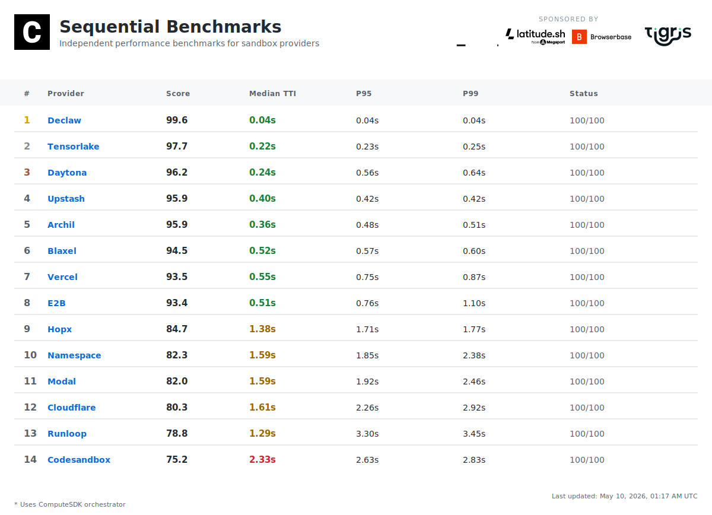
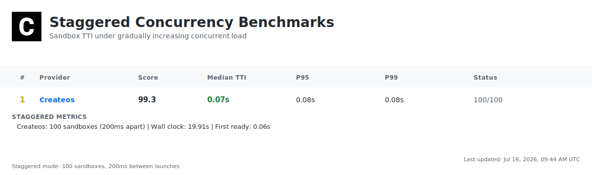
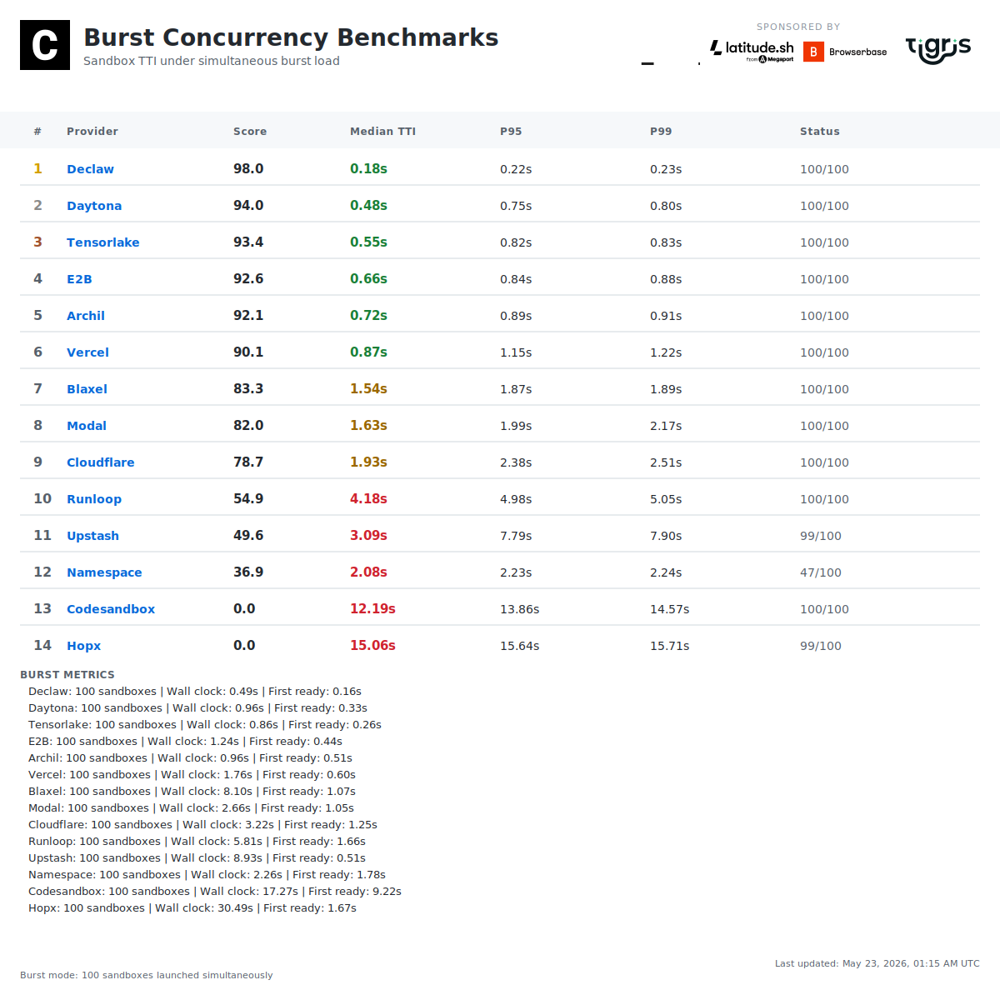
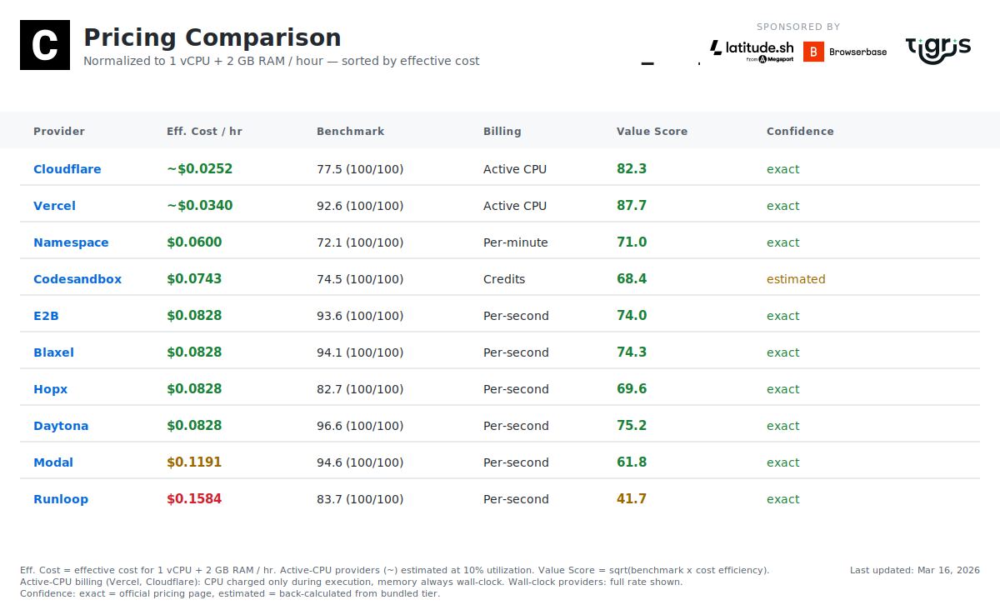
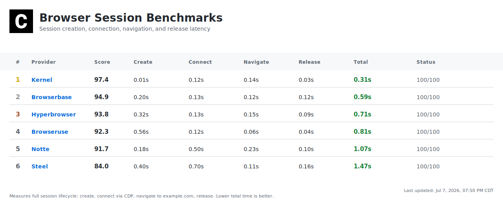
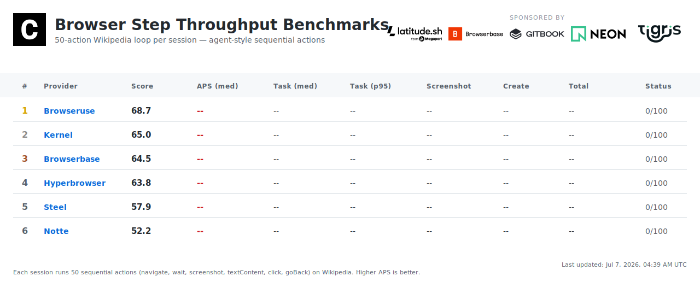
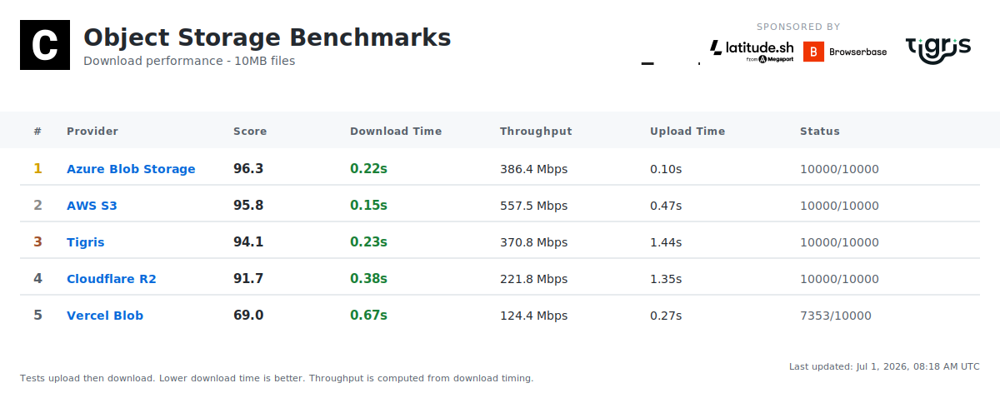
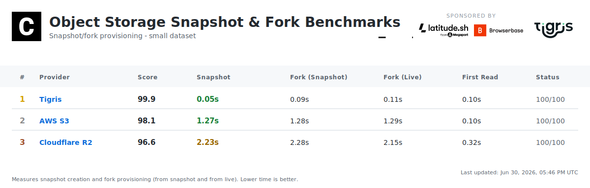

## Partners

Our partners support our independent benchmarks.

<p align="center"><sub><strong>★ SILVER</strong></sub></p>
<p align="center">
  <a href="https://latitude.sh/?utm_source=github&utm_medium=readme&utm_campaign=benchmarks-sponsor">
    <picture>
      <source media="(prefers-color-scheme: dark)" srcset="https://logos.computesdk.com/api/svg/latitude/bounded/logo-dark">
      
    </picture>
  </a>
  &nbsp;&nbsp;&nbsp;
  <a href="https://cloud.google.com/run?utm_source=github&utm_medium=readme&utm_campaign=benchmarks-sponsor">
    <picture>
      <source media="(prefers-color-scheme: dark)" srcset="https://logos.computesdk.com/api/svg/google-cloud-run/bounded/logo-dark">
      
    </picture>
  </a>
</p>

<p align="center"><sub><strong>+ BRONZE</strong></sub></p>
<p align="center">
  <a href="https://www.browserbase.com/?utm_source=github&utm_medium=readme&utm_campaign=benchmarks-sponsor">
    <picture>
      <source media="(prefers-color-scheme: dark)" srcset="https://logos.computesdk.com/api/svg/browserbase/bounded/logo-dark">
      
    </picture>
  </a>
  &nbsp;&nbsp;&nbsp;
  <a href="https://www.tigrisdata.com/?utm_source=github&utm_medium=readme&utm_campaign=benchmarks-sponsor">
    <picture>
      <source media="(prefers-color-scheme: dark)" srcset="https://logos.computesdk.com/api/svg/tigris/bounded/logo-dark">
      
    </picture>
  </a>
  &nbsp;&nbsp;&nbsp;
  <a href="https://neon.com/?utm_source=github&utm_medium=readme&utm_campaign=benchmarks-sponsor">
    <picture>
      <source media="(prefers-color-scheme: dark)" srcset="https://logos.computesdk.com/api/svg/neon/bounded/logo-dark">
      
    </picture>
  </a>
  &nbsp;&nbsp;&nbsp;
  <a href="https://www.gitbook.com/?utm_source=github&utm_medium=readme&utm_campaign=benchmarks-sponsor">
    <picture>
      <source media="(prefers-color-scheme: dark)" srcset="https://logos.computesdk.com/api/svg/gitbook/bounded/logo-dark">
      
    </picture>
  </a>
</p>

<p align="center"><sub><strong>BENCHMARKS POWERED BY</strong></sub></p>
<p align="center">
  <a href="https://namespace.so/?utm_source=github&utm_medium=readme&utm_campaign=benchmarks-sponsor">
    <picture>
      <source media="(prefers-color-scheme: dark)" srcset="https://logos.computesdk.com/api/svg/namespace/bounded/logo-dark">
      
    </picture>
  </a>
</p>

<p align="center"><a href="./SPONSORSHIP.md">Become a sponsor →</a></p>

<br>

---

<br>

### [Sequential TTI](#sequential-tti)



### [Staggered TTI](#staggered-tti)



### [Burst TTI](#burst-tti)



### [Pricing Comparison](#pricing-comparison)



### [Browser Sessions](#browser-sessions)



### [Browser Step Throughput](#browser-step-throughput)



### [Object Storage](#object-storage)



### [Snapshot & Fork](#snapshot--fork)



[](./LICENSE)

**TTI (Time to Interactive)** = API call to first command execution. Lower is better.

<br>

## What We Measure

**Daily: Time to Interactive (TTI)**

```
API Request → Provisioning → Boot → Ready → First Command
└───────────────────── TTI ─────────────────────┘
```

Each benchmark creates a fresh sandbox, runs `node -v`, and records wall-clock time. 100 iterations per provider, every day, fully automated.

**Powered by ComputeSDK** — We use [ComputeSDK](https://github.com/computesdk/computesdk), a multi-provider SDK, to test all sandbox providers with the same code. One API, multiple providers, fair comparison. Interested in multi-provider failover, sandbox packing, and warm pooling? [Check out ComputeSDK](https://github.com/computesdk/computesdk).

**Sponsor-only tests coming soon:** Stress tests, warm starts, multi-region, and more. [See roadmap →](#roadmap)

<br>

## Methodology

Each benchmark creates a fresh sandbox, runs `node -v`, and records wall-clock time. We run three test modes daily:

**Sequential** — Sandboxes are created one at a time. Each is created, tested, and destroyed before the next begins. 100 iterations per provider. This is the baseline — isolated cold-start performance with no contention.

**Staggered** — 100 sandboxes are launched per provider with a 200ms delay between each, gradually ramping up concurrent load. Reveals how TTI degrades under increasing pressure, queue depth effects, and rate limiting behavior.

**Burst** — 100 sandboxes are created simultaneously with no delay between launches. Tests how providers handle sudden spikes — provisioning queue depth, rate limiting, and failure rates under peak demand.

For each provider we report min, max, median, P95, P99, and average TTI, plus a **composite score** (0–100) that combines weighted timing metrics with success rate. Providers must be both fast *and* reliable to score well.

### Composite Score

Before computing timing statistics, the bottom 5% and top 5% of successful iterations are trimmed to reduce outlier influence from transient network issues or cold-start anomalies. Each timing metric is then scored against a fixed 10-second ceiling: `score = 100 × (1 − value / 10,000ms)`. A 200ms median scores 98; anything ≥10s scores 0. These individual scores are combined with weighted emphasis on median (60%), P95 (25%), and P99 (15%), then multiplied by the provider's success rate (0–1). A provider with 90% success has its score reduced by 10% — reliability is non-negotiable.

All tests run on GitHub Actions at 00:00 UTC daily. Providers are tested using ComputeSDK — no gateway or proxy layer.

[Full methodology →](./METHODOLOGY.md)

<br>

## Transparency

- 📖 **Open source** — All benchmark code is public
- 📊 **Raw data** — Every result committed to repo
- 🔁 **Reproducible** — Anyone can run the same tests
- ⚙️ **Automated** — Daily at 5pm Pacific (00:00 UTC) via GitHub Actions on Namespace runners
- 🛡️ **Independent** — Sponsors cannot influence results

<br>

## Roadmap

- [x] computesdk.com/benchmarks
- [x] Add P95 & P99
- [x] TTI n=100 test
- [x] TTI n=100 concurrency test (staggered + burst)
- [x] 100,000 concurrent sandbox stress test
- [ ] Cold start vs warm start metrics
- [ ] Multi-region testing
- [x] Cost-per-sandbox-minute

<br>

---

MIT License
